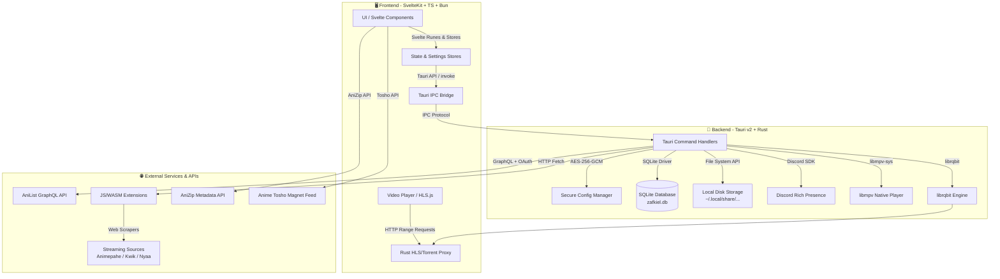

<div align="center">

# 📦 Zafkiel — Desktop Anime Watching Platform

**A modern, high-performance, cross-platform desktop anime player built with SvelteKit and Tauri, featuring secure AniList integration, automated local image caching, a dynamic theme styling engine, and an extensible sandboxed streaming plugin architecture.**

[](LICENSE)
[](https://svelte.dev)
[](https://tauri.app)
[](https://www.rust-lang.org)

</div>

---

## 🏗️ Architecture



Zafkiel uses a split-process client architecture. The user interface runs on a lightweight SvelteKit frontend bundled using Vite. The Svelte application interacts with the native OS via **Tauri v2 IPC (Inter-Process Communication)**. High-performance operations such as decryption, local SQLite database management, Discord Rich Presence, native libmpv bindings, and torrent streaming (via the **librqbit** engine) are delegated to the Rust backend.

---

## ✨ Features

| Category | Feature |
|:---|:---|
| 📺 **Airing & Browse** | Interactive browsing for trending, popular, upcoming, and seasonal anime |
| 🔍 **Advanced Search** | Unified search across anime, manga, characters, staff, and user profiles |
| 👤 **AniList Sync** | Complete AniList profile integration, tracking lists, updating progress, and score syncing |
| 🔑 **Secure OAuth** | Native OAuth authentication flow with sessionStorage caching (5-min TTL) |
| ⚡ **Smart Cache** | Double-layer cache: SQLite metadata storage and local disk image caching to minimize network usage |
| 🔄 **Extensions** | Plugin system supporting local and remote JS/WASM scrapers (e.g. AnimePahe, Anime Tosho, Nyaa) |
| 🎥 **Dual-Player** | Standard Web/HLS.js player and hardware-accelerated local player via a native `libmpv` plugin |
| 💾 **Torrents** | On-the-fly torrent streaming via Rust `librqbit` engine with HTTP range request server |
| 🎮 **Discord RPC** | Native Discord Rich Presence integration matching real-time playback and titles |
| 🎨 **Theme Engine** | Custom theme configurations with glow & blur toggles, smooth scroll, and UI scaling |
| 🛠️ **Config Storage** | AES-256-GCM encrypted RON (Rusty Object Notation) files for secure token storage |
| 🛡️ **Diagnostics** | Comprehensive console logging, real-time cache tracking, and debug page (`/config-demo`) |

---

## 🛠️ Tech Stack

| Layer | Technology | Purpose |
|:---|:---|:---|
| Languages | TypeScript, Rust, SQL | Frontend, Backend, Database scripts |
| Frontend Framework | Svelte 5 / SvelteKit 2 | User interface and routing |
| Backend Framework | Tauri v2 | Native OS windowing and IPC bridge |
| Database | SQLite (via better-sqlite3) | Metadata and image cache mapping |
| Video Playback | HLS.js & libmpv | Video streaming and hardware-accelerated playback |
| Torrent Client | librqbit (Rust), webtorrent | High-speed torrent streaming and downloading |
| State Management | TanStack Query v6, Svelte Runes | Reactive API queries and state stores |
| Encrypt / Security | AES-256-GCM (Rust) | Encryption of credentials / AniList API tokens |
| Rich Presence | discord-sdk (Rust) | Discord RPC integration |
| Package Manager | Bun | Package dependency and script runner |
| Formatter / Linter | Prettier, ESLint | Code format and linting standards |

---

## 🚀 Quick Start

### Prerequisites

- **Bun (>= 1.0)** — [install](https://bun.sh)
- **Rust & Cargo** — [install](https://www.rust-lang.org/tools/install)
- **libmpv** — Required for native hardware-accelerated playback:
  - **macOS**: `brew install mpv`
  - **Linux (Debian/Ubuntu)**: `sudo apt install libmpv-dev`
  - **Windows**: Download libmpv builds from [mpv.io](https://mpv.io/) and add the binary folder to your system PATH.

### 1. Clone & Install Dependencies

```bash
git clone https://github.com/Thunder-Blaze/zafkiel.git
cd zafkiel

# Install dependencies using Bun
bun install
```

### 2. Set Up OAuth

Create an AniList OAuth application under [AniList Developer Settings](https://anilist.co/settings/developer) with Redirect URL set to `http://localhost:57575/auth/callback`.

Copy the template environment file and add your credentials:

```bash
cp .env.example .env
```

Open `.env` and fill in the values:

```env
DATABASE_URL=local.db
ANILIST_CLIENT_ID=your_client_id_here
```

### 3. Run Development Server

```bash
# Runs the Vite dev server and opens the Tauri native window
bun run tauri dev
```

### 4. Build Production Release

To compile and package Zafkiel for production distribution:

```bash
bun run build
```

This will create a distributable installer in `src-tauri/target/release/bundle/`.

---

## 📡 Tauri Command Reference

The SvelteKit frontend invokes Rust backend functionality using Tauri's IPC system:

```typescript
import { invoke } from '@tauri-apps/api/core';
```

### Configuration management

```typescript
// Fetch full configuration file
const config = await invoke('get_config');

// Update UI scale settings (persists in config.ron)
await invoke('update_ui_scale', { scale: 1.1 });

// Update active UI theme
await invoke('update_theme', { theme: 'catppuccin' });
```

### Authentication Flow

```typescript
// Start the OAuth server and wait for the browser redirect callback
await invoke('start_oauth_flow');

// Check authentication status
const isAuthed = await invoke('check_auth_status');
```

### Image Caching & Storage

```typescript
// Query cache stats
const stats = await invoke('get_cache_stats');

// Download and cache an external cover image
const localPath = await invoke('cache_image', {
    originalUrl: 'https://img.anilist.co/media/anime/cover/large/...',
    mediaId: 12345,
    mediaType: 'ANIME'
});
```

---

## ⚙️ Configuration

Zafkiel isolates configurations across environments. Settings are written in **RON (Rusty Object Notation)** and stored under:

- **Linux / macOS**: `~/.config/zafkiel/`
- **Windows**: `%APPDATA%\zafkiel\`

### Environment Configuration Files

- `config.ron` — Production Release mode
- `config.debug.ron` — Local Development mode
- `config.test.ron` — Automated Testing mode

### Example Config Structure (`config.ron`)

Sensitive information, such as the `access_token`, is encrypted using **AES-256-GCM** before being written to disk:

```ron
(
    anilist: (
        access_token: Some("YmFzZTY0X2VuY3J5cHRlZF90b2tlbl9oZXJl"),
    ),
    security: (
        encryption_key: "YmFzZTY0X2VuY29kZWRfa2V5X2hlcmU=",
    ),
    ui: (
        theme: "catppuccin",
        glow_effects: true,
        blur_effects: true,
        animations: true,
        smooth_scroll: true,
        ui_scale: 1.0,
    ),
)
```

---

## 🧪 Testing

```bash
# Run Svelte unit tests (Vitest)
bun run test:unit

# Run End-to-End browser tests (Playwright)
bun run test:e2e

# Run Rust backend test suites
cd src-tauri
cargo test
```

---

## 📖 Documentation

| Document | Description |
|:---|:---|
| [OAuth Setup Guide](docs/OAUTH_SETUP.md) | How to set up AniList developer credentials |
| [Authentication Flow](docs/AUTHENTICATION.md) | In-depth breakdown of OAuth flow and session caching |
| [Config System Guide](docs/CONFIG.md) | AES-256-GCM encryption architecture and config files |
| [Client Architecture](docs/ANILIST_CLIENT_ARCHITECTURE.md) | Svelte-to-Rust communication architecture |
| [Theme Architecture](docs/THEME_ARCHITECTURE.md) | Theme styles, smooth scrolling, and glow/blur options |
| [UI Scale Solution](docs/UI_SCALE_IMPLEMENTATION.md) | Webview scaling and custom titlebar height implementation |
| [Android Playback Plan](docs/ANDROID_PLAYER.md) | ExoPlayer integration and mobile playback design |
| [Testing & Caching Guide](docs/TESTING_GUIDE.md) | Manual cache validation, database queries, and test steps |

---

## 🤝 Contributing

1. Fork the repository
2. Create your feature branch: `git checkout -b feature/my-new-feature`
3. Commit your changes: `git commit -am 'feat: add some amazing feature'`
4. Push to the branch: `git push origin feature/my-new-feature`
5. Open a Pull Request

### Code Conventions

- All Rust code must be formatted via `cargo fmt` and clean of critical `cargo clippy` lints.
- All TypeScript and Svelte files must pass ESLint and Prettier checks (`bun run lint`).

---

## 📄 License

This project is licensed under the MIT License — see the [LICENSE](LICENSE) file for details.

---

<div align="center">

**Built with ❤️ in SvelteKit & Rust**

[Report Bug](https://github.com/Thunder-Blaze/zafkiel/issues) · [Request Feature](https://github.com/Thunder-Blaze/zafkiel/issues) · [Discussions](https://github.com/Thunder-Blaze/zafkiel/discussions)

</div>
