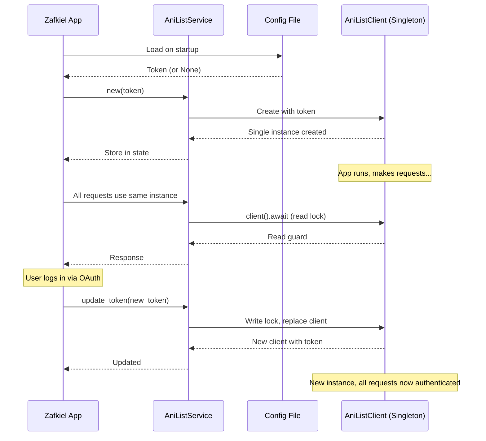

# AniList Client State Management

## Architecture

The Zafkiel app maintains a **single `AniListClient` instance** in Tauri's app state throughout the application lifetime. This design ensures:

- ✅ **Efficiency**: No client cloning on every request
- ✅ **Consistency**: Single source of truth for authentication state
- ✅ **Thread Safety**: Protected by `Arc<RwLock<AniListClient>>`
- ✅ **Token Management**: Dynamic token updates without recreating the service

## Implementation

### State Structure

```rust
pub struct AniListService {
    client: Arc<RwLock<AniListClient>>,
}
```

- **`Arc`**: Allows shared ownership across threads
- **`RwLock`**: Allows multiple concurrent reads, exclusive writes
- **`AniListClient`**: The actual anilist_moe client instance

### Initialization

```rust
// In src-tauri/src/lib.rs setup()

// Load token from config if available
let token = config_loader
    .get_config()
    .ok()
    .and_then(|config| config.anilist_token);

// Create service with token (or None if not authenticated)
let anilist_service = AniListService::new(token);

// Store in app state - this instance persists for entire app lifetime
app.manage(Arc::new(anilist_service));
```

### Client Access Pattern

```rust
// Private helper method - returns read guard, no cloning!
async fn client(&self) -> tokio::sync::RwLockReadGuard<'_, AniListClient> {
    self.client.read().await
}

// Usage in methods
pub async fn get_trending_anime(&self, ...) -> Result<Vec<Media>, AniListError> {
    let client = self.client().await;  // Get read guard
    let response = client.anime().get_trending_anime(...).await?;
    Ok(response.data.page.data.media)
}
// Read guard automatically released when method returns
```

**Key Benefits:**
- No `.clone()` - just a reference through the read guard
- Multiple requests can run concurrently (multiple readers)
- Memory efficient - single client instance

### Token Updates

```rust
pub async fn update_token(&self, token: Option<String>) -> Result<(), String> {
    let mut client = self.client.write().await;  // Get write lock
    *client = if let Some(t) = token {
        AniListClient::with_token(&t)  // Create new client with token
    } else {
        AniListClient::new()  // Create anonymous client
    };
    Ok(())
}
// Write lock released, all future requests use new client
```

**When Token Updates Happen:**
1. **App Startup**: Loads token from config if exists
2. **After OAuth Login**: Updates client with new token
3. **After Logout**: Replaces client with anonymous client

## Lifecycle

```mermaid
stateDiagram-v2
    [*] --> AppStartup
    AppStartup --> LoadConfig
    LoadConfig --> HasToken: Token exists
    LoadConfig --> NoToken: No token
    
    HasToken --> CreateAuthClient: AniListClient::with_token()
    NoToken --> CreateAnonClient: AniListClient::new()
    
    CreateAuthClient --> StoreInState
    CreateAnonClient --> StoreInState
    
    StoreInState --> Ready: app.manage(Arc::new(service))
    
    Ready --> MakeRequests: All API calls use same instance
    Ready --> Login: User logs in
    Ready --> Logout: User logs out
    
    Login --> UpdateToken: service.update_token(Some(token))
    Logout --> UpdateToken: service.update_token(None)
    
    UpdateToken --> Ready: Client replaced, continues serving
    
    MakeRequests --> MakeRequests: Concurrent requests OK
```

## Thread Safety

### Concurrent Reads
```rust
// Multiple requests can run simultaneously
let service: Arc<AniListService> = app.state();

// Request 1 (thread A)
let trending = service.get_trending_anime(...).await;

// Request 2 (thread B) - runs concurrently!
let popular = service.get_popular_anime(...).await;

// Both acquire read locks simultaneously ✅
```

### Write Safety
```rust
// Token update (exclusive access)
service.update_token(Some(token)).await;

// All reads blocked until write completes
// Then all new reads use updated client
```

## Command Layer

Every Tauri command accesses the same instance:

```rust
#[tauri::command]
pub async fn get_trending_anime(
    anilist_service: State<'_, Arc<AniListService>>,  // ← Same instance
    page: Option<i32>,
    per_page: Option<i32>,
) -> Result<AniListResponse<Vec<Media>>, String> {
    // Uses the singleton instance
    let result = anilist_service.get_trending_anime(page, per_page).await;
    Ok(result.into())
}
```

## Performance Benefits

### Before (Cloning)
```rust
// ❌ Old approach - creates copy on every request
let client = self.client.read().await.clone();  // Clone entire client!
let response = client.anime().get_trending_anime(...).await?;
```

**Costs:**
- Memory allocation for cloned client
- Copying all internal state (HTTP client, rate limiter, etc.)
- Garbage collection overhead

### After (Read Guard)
```rust
// ✅ New approach - reference only
let client = self.client().await;  // Just a reference via read guard
let response = client.anime().get_trending_anime(...).await?;
```

**Benefits:**
- Zero memory allocation
- No copying
- Direct access to singleton instance

## Token Persistence Flow



## Best Practices

### ✅ DO:
- Access via `self.client().await` for reads
- Use `RwLock::write()` only for token updates
- Let read guards drop automatically (don't store them)
- Trust the singleton - it's always available

### ❌ DON'T:
- Clone the client unless absolutely necessary
- Hold read/write locks across `.await` points
- Create new `AniListService` instances
- Access `self.client` directly (use `self.client()` helper)

## Testing

The singleton pattern makes testing straightforward:

```rust
#[tokio::test]
async fn test_concurrent_requests() {
    let service = Arc::new(AniListService::new(None));
    
    // Spawn concurrent requests
    let service1 = service.clone();
    let service2 = service.clone();
    
    let task1 = tokio::spawn(async move {
        service1.get_trending_anime(None, None).await
    });
    
    let task2 = tokio::spawn(async move {
        service2.get_popular_anime(None, None).await
    });
    
    // Both use same underlying client ✅
    let (result1, result2) = tokio::join!(task1, task2);
}
```

## Summary

The `AniListService` maintains a **single, shared `AniListClient` instance** in Tauri's app state:

1. **Created once** at app startup with token from config
2. **Stored in app state** via `app.manage(Arc::new(service))`
3. **Accessed efficiently** via read guards (no cloning)
4. **Updated dynamically** when user logs in/out
5. **Thread-safe** via `RwLock` for concurrent access
6. **Memory efficient** - one instance for entire app lifetime

This design provides optimal performance while maintaining clean separation between the HTTP client layer (anilist_moe) and the application logic (Tauri commands).
