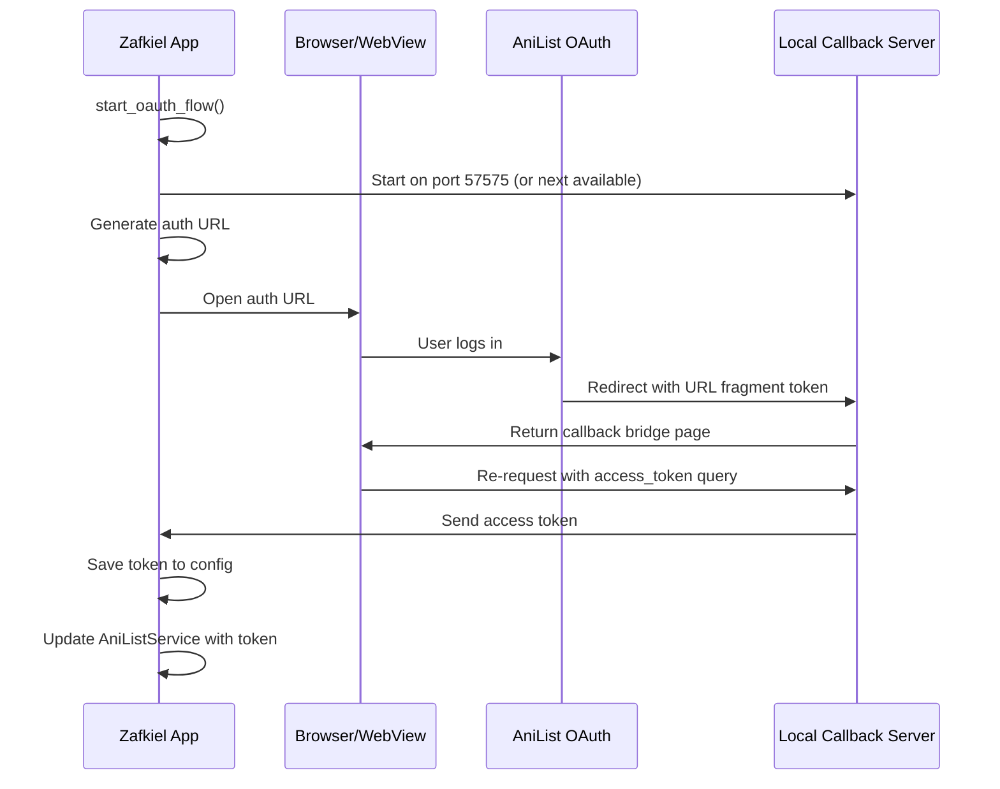

# AniList OAuth Authentication

## Overview

Complete OAuth 2.0 authentication flow for AniList with browser-based authorization and automatic fallback to webview.

## Backend Implementation

### Modules Created

1. **`src-tauri/src/auth.rs`** - Core OAuth logic
   - `find_available_port()` - Finds open port, prefers 57575
   - `get_authorization_url()` - Generates OAuth URL
   - `exchange_code_for_token()` - Exchanges code for access token
   - `start_callback_server()` - Local HTTP server for OAuth callback
   - `AuthState` - Manages pending OAuth requests

2. **`src-tauri/src/auth_commands.rs`** - Tauri commands
   - `start_oauth_flow` - Initializes OAuth, returns URL and port
   - `open_auth_browser` - Opens URL in browser (fallback to webview)
   - `wait_for_oauth_callback` - Waits for callback, exchanges code
   - `check_auth_status` - Verifies authentication by fetching user
   - `logout` - Clears stored token

3. **Updated `src-tauri/src/anilist.rs`**
   - Changed from `Arc<Mutex<>>` to `Arc<RwLock<>>` for async safety
   - Added `update_token()` method for dynamic token updates

4. **Updated `src-tauri/src/config/mod.rs`**
   - Added `load_or_default()` and `save()` helper functions
   - Token stored encrypted in `~/.config/zafkiel/config.ron`

### Dependencies Added

```toml
tokio = { version = "1", features = ["full"] }
reqwest = { version = "0.12", features = ["json"] }
url = "2.5"
urlencoding = "2.1"
open = "5.3"
```

## Frontend Implementation

### Services

1. **`src/lib/services/auth.ts`** - Auth API wrapper
   - `startOAuthFlow()` - Starts OAuth flow
   - `openAuthBrowser()` - Opens browser
   - `waitForOAuthCallback()` - Waits for callback (5min timeout)
   - `checkAuthStatus()` - Checks if authenticated
   - `logout()` - Clears token
   - `completeOAuthFlow()` - Complete flow helper

### Stores

2. **`src/lib/stores/auth.ts`** - Authentication state
   - `authStore` - Main auth state store
   - `isAuthenticated` - Derived boolean
   - `currentUser` - Derived user object
   - `authLoading` - Derived loading state
   - `authError` - Derived error message
   - Methods: `init()`, `login()`, `logout()`, `clearError()`

## OAuth Flow



## Environment Setup

### 1. Get AniList OAuth Credentials

1. Go to https://anilist.co/settings/developer
2. Create a new client
3. Set redirect URI: `http://localhost:57575/auth/callback`
4. Copy Client ID

### 2. Configure Environment

Create `.env` file:

```env
ANILIST_CLIENT_ID=your_client_id
```

## Usage

### Initialize Auth on App Startup

```typescript
// In +layout.svelte
import { onMount } from 'svelte';
import { authStore } from '$lib/stores/auth';

onMount(async () => {
	await authStore.init();
});
```

### Login Flow

```typescript
import { authStore } from '$lib/stores/auth';

async function handleLogin() {
	try {
		await authStore.login();
		// User is now authenticated
	} catch (error) {
		console.error('Login failed:', error);
	}
}
```

### Check Auth Status

```svelte
<script>
	import { isAuthenticated, currentUser, authLoading } from '$lib/stores/auth';
</script>

{#if $authLoading}
	<p>Loading...</p>
{:else if $isAuthenticated}
	<p>Welcome, {$currentUser?.name}!</p>
{:else}
	<button on:click={() => authStore.login()}> Login with AniList </button>
{/if}
```

### Logout

```typescript
import { authStore } from '$lib/stores/auth';

async function handleLogout() {
	await authStore.logout();
}
```

## Features

- ✅ **Browser-first auth** - Opens system default browser
- ✅ **Webview fallback** - Opens webview if no browser available
- ✅ **Smart port selection** - Prefers 57575, finds alternatives
- ✅ **Async-safe** - Uses `RwLock` for concurrent access
- ✅ **Token persistence** - Encrypted storage in config
- ✅ **Auto token refresh** - Updates service after auth
- ✅ **Beautiful callback page** - Styled success page
- ✅ **Timeout handling** - 5-minute timeout for auth flow
- ✅ **Error handling** - Comprehensive error messages

## Security Notes

1. **Token Storage**: Tokens stored encrypted in `~/.config/zafkiel/config.ron`
2. **Environment Variables**: Client secrets in `.env` (never commit!)
3. **Local Server**: Callback server only binds to `127.0.0.1` (localhost)
4. **Timeout**: OAuth flow times out after 5 minutes

## Testing

1. Run the app: `bun run tauri dev`
2. Click "Login with AniList"
3. Browser opens to AniList OAuth page
4. Log in and authorize
5. Browser shows success page
6. App receives token and fetches user profile

## Troubleshooting

### Port already in use

- Server tries ports 57575-57600
- Falls back to OS-assigned port
- Check console for actual port used

### Browser doesn't open

- Falls back to webview automatically
- Check logs for errors

### Token not saving

- Check config directory permissions
- Verify encryption key generation
- Check logs for serialization errors

### Authentication fails

- Verify `.env` credentials
- Check redirect URI matches registered URI
- Ensure client ID/secret are correct
- Check AniList developer console for errors

## Next Steps

- [ ] Add token refresh logic (AniList tokens don't expire, but good practice)
- [ ] Add "Remember me" option
- [ ] Add multiple account support
- [ ] Add OAuth state parameter for security
- [ ] Add PKCE for enhanced security
